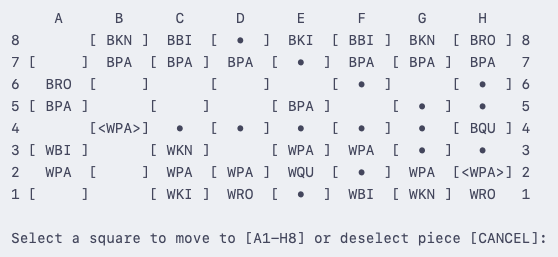

# Console chess game in Java
Two-player chess game written in Java. It is a standard chess game consisting of teams 16 white and black chess pieces. Each player can select a piece and cell to move the piece to. To win, the enemy king must be put into a checkmate. 

